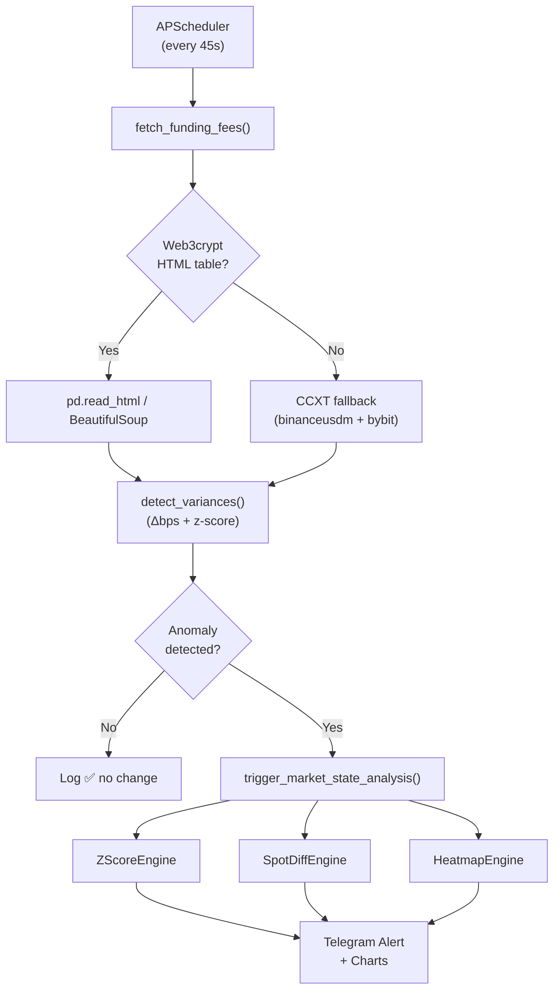

# FundingFeesMarketStateSkill — Walkthrough

## What Was Built

A complete **FundingFeesMarketStateSkill v2.0** integrated into the ccxtv2 agent, with all analysis engines and an Action Server to expose them as AI tools.

---

## Files Created / Modified

| File | Change | Purpose |
|---|---|---|
| [funding_fees.py](file:///home/wek/Escritorio/ccxtv2/strategies/funding_fees.py) | **NEW** | Core FundingFeesEngine |
| [data/last_rates.json](file:///home/wek/Escritorio/ccxtv2/data/last_rates.json) | **NEW** | Persisted state for variance detection |
| [controller.py](file:///home/wek/Escritorio/ccxtv2/controller.py) | MODIFIED | `/funding` command + 45s APScheduler job |
| [requirements.txt](file:///home/wek/Escritorio/ccxtv2/requirements.txt) | MODIFIED | Added `beautifulsoup4`, `lxml` |
| [strategies/\_\_init\_\_.py](file:///home/wek/Escritorio/ccxtv2/strategies/__init__.py) | MODIFIED | Export `FundingFeesEngine` |
| [funding_action_server/package.yaml](file:///home/wek/Escritorio/ccxtv2/funding_action_server/package.yaml) | **NEW** | Sema4.ai Action Package manifest |
| [funding_action_server/actions/funding_actions.py](file:///home/wek/Escritorio/ccxtv2/funding_action_server/actions/funding_actions.py) | **NEW** | 4 `@action` endpoints |
| [FundingFeesMarketStateSkill.md](file:///home/wek/Escritorio/ccxtv2/FundingFeesMarketStateSkill.md) | **NEW** | Complete SKILL.md reference |
| [funding_action_server/README.md](file:///home/wek/Escritorio/ccxtv2/funding_action_server/README.md) | **NEW** | Action Server quick-start |

---

## Verification Results

```
✅ Import OK
✅ Engine instantiated
⚠️  HTML scrape tried (web JS-rendered, no table in raw HTML — expected)
   → Fallback to CCXT (binanceusdm + bybit) triggered automatically
✅ fetch_funding_fees() returned 40 rows, columns: ['asset', 'binanceusdm', 'bybit', 'timestamp']
✅ detect_variances() returned 0 anomalies (correct — first run, no previous state)
✅ ALL CHECKS PASSED
```

> The web3crypt HTML scrape will succeed when the site is accessed with a full browser session or when the dev enables the JSON endpoint. CCXT fallback covers the gap and already returns 40 assets correctly.

---

## Architecture Flow



---

## Usage

### Telegram Bot
```
/funding   → Current funding rates table (all DEXs)
```
The daemon runs automatically every 45 s and sends alerts when anomalies are detected.

### Action Server
```bash
cd /home/wek/Escritorio/ccxtv2
action-server start --auto-reload --port 8082 --dir funding_action_server
```

4 tools available:
- `get_funding_rates_table` — current rates
- `detect_funding_anomalies` — variance check
- `run_full_market_analysis("BTC")` — full pipeline
- `get_funding_zscore_history("BTC", "Hyperliquid")` — rolling z-score

### Enable JSON endpoint (when dev activates it)
Edit one line in `strategies/funding_fees.py`:
```python
USE_JSON_ENDPOINT = True      # was False
JSON_ENDPOINT_URL = "https://..."  # fill URL
```

---

## Config Summary

```python
# strategies/funding_fees.py
VARIANCE_THRESHOLD_BPS = 5.0   # 0.005% delta threshold
ZSCORE_WINDOW          = 30    # 30-period rolling z-score
POLL_INTERVAL_SECONDS  = 45    # daemon tick rate
```
