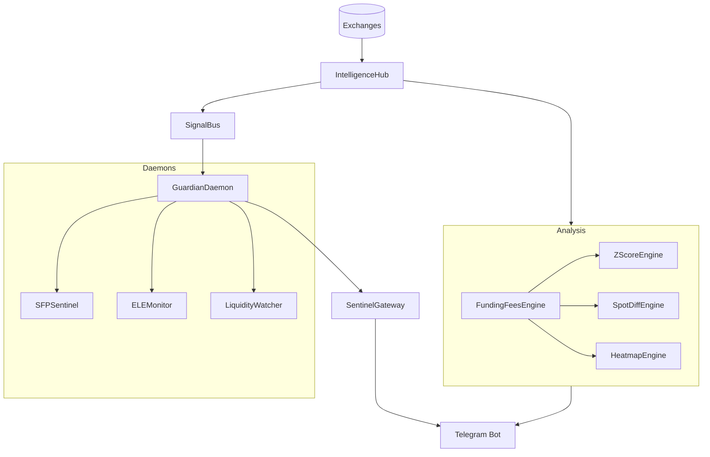

# 🗺️ CCXTV2 — DOCUMENTACIÓN INTEGRA (Senior Desk Edition)

Esta documentación consolida el estado real del sistema tras la reestructuración de Abril 2026, eliminando el ruido detectado en el `GRAPH_REPORT.md` y enfocándose en los nodos de alta centralidad.

---

## 1. Mapa de Abstracción (The God Nodes)

El sistema pivota sobre 6 pilares fundamentales. Si estos nodos fallan, el sistema queda ciego o inerte.

| Nodo | Responsabilidad | Dependencias Críticas |
|:---|:---|:---|
| **IntelligenceHub** | El cerebro. Centraliza conexiones CCXT y cálculos PhD. | `ccxt`, `core/config.py` |
| **GuardianDaemon** | El supervisor. Orquesta las 7 tareas de monitoreo 24/7. | `SentinelGateway`, `daemons/*` |
| **ActionServer** | La interfaz. Expone el sistema a agentes y scripts externos. | `funding_action_server/` |
| **FundingFeesEngine** | El radar. Detecta anomalías de flujo global. | `strategies/funding_fees.py` |
| **ZScoreEngine** | El validador. Define el valor intrínseco y Wyckoff. | `strategies/zscore.py` |
| **SignalBus** | El sistema nervioso. Pub/Sub asíncrono entre módulos. | `core/bus/` |

---

## 2. Arquitectura de Flujo de Datos

---

## 3. Guía de Interpretación Táctica (Master Matrix)

### A. Escalamiento de Señal
1. **SCALP**: Se activa con `Toxicity > 0.6` y `OBI > 0.35`. Es un estallido de 1-15m.
2. **INTRADAY**: Si el Scalp se mantiene y el `Basis < -0.03%`, escalamos a Intraday.
3. **SWING**: Solo si el `Z-Score < -0.5` y hay acumulación Wyckoff confirmada.

### B. Protocolo de Aborto (Kill Switch)
- Si `Confidence Score` en UDC cae por debajo de 30.
- Si `Toxicity` cae a `< 0.25` durante una posición (Smart Money se retiró).
- Si hay divergencia masiva de CVD entre Binance y OKX.

---

## 4. Auditoría de Salud y Mantenimiento

El sistema incluye un suite de pruebas unitarias de baja latencia en `tests/`:

- **Conectividad**: `python3 tests/test_intelligence_hub.py`
- **Anomalías**: `python3 tests/test_funding_fees.py`
- **Microestructura**: `python3 tests/test_absorption.py`
- **Valuación**: `python3 tests/test_zscore.py`

---

## 5. Glosario de Métricas Institucionales

- **OBI (Order Book Imbalance)**: Diferencia porcentual entre volumen Bid/Ask en los primeros 20 niveles.
- **VPIN (VPIN-inspired Toxicity)**: Probabilidad de que el flujo actual sea de traders informados.
- **Kyle's Lambda**: Impacto en el precio por cada $1M de flujo. Mide la profundidad real.
- **Basis**: Diferencia Spot vs Perp. Indica quién lidera el movimiento (Retail vs Institucional).

---
*Fin de Documentación Integra v2.0*
