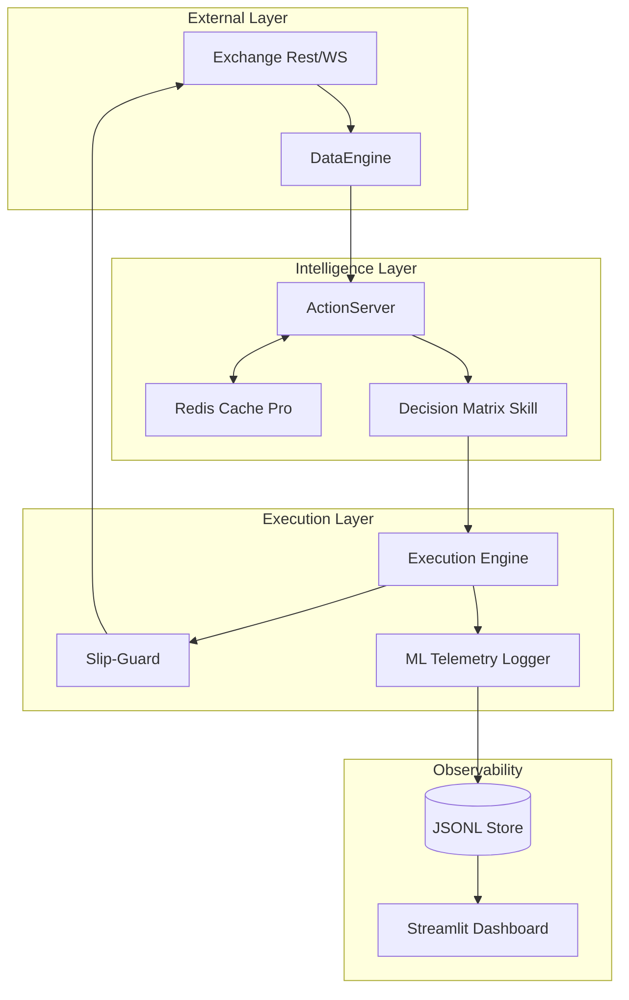

# 🏛️ ccxtv2 — Master Architecture & Institutional Ground Truth
━━━━━━━━━━━━━━━━━━━━━━━━━━━━━━━━━━━━━━━━━━━━━━━━━━━━━━━━━━━━━━━━━━━━━━━━

## 🏆 Project DNA
`ccxtv2` es el motor de inteligencia y ejecución algorítmica definitiva para el High-Frequency Institutional Trading. Su arquitectura desacopla el **Sensing** (DataEngine), **Thinking** (Decision Matrix) y **Acting** (Execution Engine), permitiendo una escalabilidad infinita y adaptabilidad a regímenes de mercado volátiles.

---

## 🏛️ Architecture & Data Map
El sistema respira a través de un ecosistema Redis-Native descentralizado.



---

## 🔬 Microstructure Glossary (CTO Level)
| Métrica | Definición Técnica | Umbral Crítico |
| :--- | :--- | :--- |
| **VPIN (Toxicity)** | Probabilidad de trading informado basado en desequilibrio de volumen por tiempo. | > 0.70 (Informed Entry) |
| **Kyle's Lambda ($\lambda$)** | Coeficiente de iliquidez. Mide cuánto mueve el precio 1 BTC de volumen. | > 0.05 (High Impact) |
| **CVD Acceleration** | La tasa de cambio de la velocidad del CVD. Detector de "God Candles". | Positive (Aggressiveness) |
| **Wall Velocity** | Vector de re-posicionamiento de muros institucionales. | $V_{wall} \gg V_{price}$ (GHOST) |
| **Neural Decay** | Degradación de la persistencia de señal tras una absorción masiva. | Alpha Halving Period |
| **Berlin Wall** | Umbral de Toxicidad (VPIN). Por debajo es "Retail Soup". | > 0.62 (Informed) |
| **Spot Floor** | Basis (Spot-Perp) confirmando acumulación real. | < -0.05% (Premium) |

---

## 📜 Historical Case Studies (ML Ground Truth)

### ⚔️ Case A: The BTC "Ghost Wall" Trap ($77,761)
- **Escenario:** Un muro masivo de 8.8 BTC apareció en $77,761 mientras el precio subía desde $77,740.
- **Anomalía Detectada:** El `get-wall-velocity` reportó un vector de movimiento del muro mayor a la velocidad del market price ($V_{wall} > V_{price}$).
- **Veredicto:** **SPOOFING**. El muro no buscaba ser ejecutado, sino inducir ventas retail ("Fake Resistance"). 
- **Resultado:** Tras retirar el muro, se activó un **Vacuum Effect** (Vacío de Liquidez), llevando el precio a $78,100 en milisegundos.

### ⚔️ Case B: The ETH "Aggression Phase" ($2,320)
- **Escenario:** Acumulación Wyckoff estable.
- **Anomalía Detectada:** `iceberg_score` bajó a 0.01 pero el `toxicity_index` saltó de 0.39 a 0.68.
- **Veredicto:** **MARKET IGNITION**. Las instituciones dejaron de comprar pasivamente (Icebergs) y empezaron a barrer el Ask (Market Buys).
- **Resultado:** El LADDER LONG se convirtió en un **MARKET IGNITION ENTRY**, capturando el inicio de la expansión vertical.

---

## 🛠️ Master Operational Guide

### 1. Rutinas & Workflows (/slash commands)
| Comando | Propósito | Endpoints Clave |
| :--- | :--- | :--- |
| `/flow-scalp` | Explosión de Micro-Tendencia | Toxicity, OBI_20, CVD |
| `/flow-intraday` | Captura de Sesión & SFP | Deep-Confluence, Basis |
| `/flow-swing` | Cambio de Régimen & HTF | OI_Snapshot, Historical Z-Score |
| `/alpha_ignition` | Validación de Momentum Clusters | CVD'', Kyle's Lambda |

### 2. Endpoints Críticos (Action Server)
- **`get-wall-velocity`**: Audit de liquidez real vs spoofing.
- **`get-toxicity-index`**: Cuantificación del Informed Flow.
- **`get-delta-acceleration`**: Detector de aceleración de demanda ($CVD''$).

### 3. Ejecución Predatoria
Para activar el centro de control y el bot de ejecución:
```bash
# Terminal 1: Servidor de Acciones
action-server start --auto-reload --port 8080 --dir funding_action_server

# Terminal 2: Dashboard de Observabilidad
streamlit run ml_dashboard.py

# Terminal 3: Bot de Ejecución
python3 activate_predatory_sniper.py --ml-capture --telemetry-enabled
```

---

## 🏗️ Master System Inventory

### 1. Unified Workflow Index (.agents/workflows/)
| Workflow | Responsibility | Key Indicators | Target |
| :--- | :--- | :--- | :--- |
| `alpha_ignition` | Validates initial momentum clusters. | CVD'' > 0 | Ignition |
| `ele_transition` | Transitions SFP scalps to Intraday. | Basis Divergence | Trend |
| `flow_scalp` | Captures micro-second book imbalances. | Toxicity > 0.7 | Scalp |
| `flow_intraday` | Maps session clusters and institutional nodes. | OBI + Z-Score | Intraday |
| `flow_swing` | HTF regime change and OI accumulation. | Basis < -0.05% | Swing |
| `ultra_deep` | Cross-exchange institutional audit (Depth 200). | Confluence % | Key Level |

### 2. Action Endpoint Registry
| Action Name | Module | Logic Base | Area |
| :--- | :--- | :--- | :--- |
| `get-toxicity-index` | `market_actions.py` | VPIN + Icebergs | Alpha Selection |
| `get-wall-velocity` | `market_actions.py` | Redis PRO ($V_w$ vs $V_p$) | Anti-Spoofing |
| `get-delta-acceleration`| `market_actions.py` | $CVD''$ (Second Derivative) | Momentum |
| `get-basis` | `market_actions.py` | Spot vs Perp Divergence | Sentiment |
| `microstructure-audit` | `audit_actions.py` | OBI + CVD + Z-Score | Snapshot |

### 3. Core Component Dependencies
- **`DataEngine`**: Unified async fetching (CCXT) across all modules.
- **`RedisWallCache`**: Persistent state engine for high-frequency metrics.
- **`MLTelemetryLogger`**: Feature engineering and reward tracking (JSONL).
- **`ExecutionEngine`**: Predatory entry/exit logic with Slip-Guard.

---

## 🛡️ ML Training Roadmap
Los logs en `logs/execution_features.jsonl` son la base para un modelo de **State-Action-Reward**.
- **State:** `[vpin, obi, basis, accel]`.
- **Action:** `[SingleOrder, TWAP_5, Abort]`.
- **Reward:** `Efficiency = (EstimatedSlippage - RealSlippage)`.

---

## 🛰️ Hybrid Operational Protocol (Surveillance to Execution)
Para maximizar el edge institucional, el sistema opera en tres capas de conciencia desacopladas:

1.  **Passive Layer (Monitoring):** Los Daemons (`opportunity_sentinel`, `squeeze_watcher`) escanean el mercado 24/7 buscando anomalías técnicas.
2.  **Tactical Layer (Audit):** Ante un alerta de Daemon, se dispara el `hybrid_audit_flow.py` que consulta el Action Server para validar **Informed Flow (VPIN)** y **Wall Velocity**.
3.  **Active Layer (Execution):** Si la auditoría confirma el edge, se activa el `activate_predatory_sniper.py` con **Slip-Guard**.
4.  **Rotation Layer (The Bridge):** El `rotation_sentinel.py` monitoriza el trasvase de Alpha de BTC a ETH cuando el líder consolida.

### Master Execution Command (Hybrid Bridge)
```bash
# Activa la auditoría táctica manual/automática sobre un activo alertado
python3 hybrid_audit_flow.py ETH/USDT:USDT

# Lanzar Centinela de Rotación en segundo plano (Guardia 24/7)
nohup python3 rotation_sentinel.py > logs/rotation.log 2>&1 &
```

---

## 🛠️ Persistence & Background Ops
Para dejar el sistema operando en **"Modo Caza"** sin supervisión:
1. **Redis:** `sudo service redis-server start` (Estado compartido).
2. **Action Server:** `action-server start --port 8080` (Capa táctica).
3. **Sentinel:** `nohup python3 rotation_sentinel.py > logs/rotation.log 2>&1 &` (Capa activa).

---

## 📝 Historical Context (The Build)
- **Pack 1.0:** Foundation & DataEngine.
- **Pack 2.0:** Microstructure Audit & Basis.
- **Pack 3.0:** Toxicity & Wall Velocity Tracking.
- **Pack 4.0:** Neural Decay ($CVD''$) & Aggression Audit.
- **Pack 5.0:** Predatory Execution & Slip-Guard.
- **Pack 6.0:** AI Ops, Telemetry & Redis Namespacing.

━━━━━━━━━━━━━━━━━━━━━━━━━━━━━━━━━━━━━━━━━━━━━━━━━━━━━━━━━━━━━━━━━━━━━━━━
*Ground Truth Verified — End-to-End Cohesion Confirmed.*
