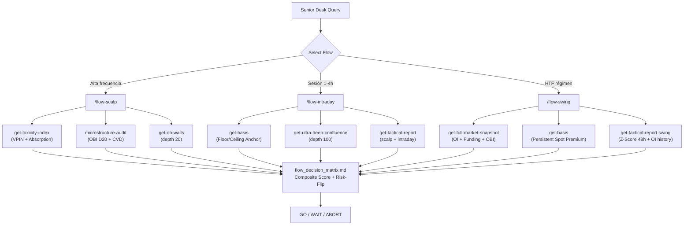

# Institutional Flow Architecture — Walkthrough

## What Was Built

4 deliverables: 1 new API endpoint + 3 specialized workflows + 1 master skill.

---

## Files Created / Modified

| File | Change | Purpose |
|:---|:---|:---|
| [market_actions.py](file:///home/wek/Escritorio/ccxtv2/funding_action_server/actions/market_actions.py) | **MODIFIED** | New [get_toxicity_index](file:///home/wek/Escritorio/ccxtv2/funding_action_server/actions/market_actions.py#141-204) endpoint |
| [flow_scalp.md](file:///home/wek/Escritorio/ccxtv2/.agents/workflows/flow_scalp.md) | **NEW** | `/flow-scalp` — Micro-trend explosion |
| [flow_intraday.md](file:///home/wek/Escritorio/ccxtv2/.agents/workflows/flow_intraday.md) | **NEW** | `/flow-intraday` — Session capture |
| [flow_swing.md](file:///home/wek/Escritorio/ccxtv2/.agents/workflows/flow_swing.md) | **NEW** | `/flow-swing` — Regime change |
| [flow_decision_matrix.md](file:///home/wek/Escritorio/ccxtv2/.agents/workflows/flow_decision_matrix.md) | **NEW** | Master Decision Matrix + Risk-Flip skill |

---

## Architecture Overview



---

## New Endpoint: `get-toxicity-index`

### What it does
Wraps the existing [AbsorptionDetector](file:///home/wek/Escritorio/ccxtv2/funding_action_server/actions/absorption_detector.py#96-271) (PhD-level VPIN module) as a REST endpoint. Returns:

| Field | Type | Meaning |
|:---|:---|:---|
| `toxicity.index` | 0-1 | VPIN-inspired probability of informed trading |
| `toxicity.verdict` | string | `TOXIC / ELEVATED / CLEAN` |
| `absorption.rate` | 0-1 | Aggressiveness of book absorption |
| `iceberg.score` | 0-1 | Hidden institutional liquidity probability |
| `kyles_lambda` | float | Price impact per unit of flow |
| `whale_pct` | % | Volume from trades ≥ whale threshold |
| `senior_verdict` | string | Composite desk verdict |

### Verification
```
✅ Syntax OK — market_actions.py (Python AST parse passed)
✅ AbsorptionDetector import path confirmed in funding_action_server/actions/
```

**curl call:**
```bash
curl -s -X POST http://localhost:8080/api/actions/funding-action-server/get-toxicity-index/run \
  -H "Content-Type: application/json" \
  -d '{"symbol": "ETH/USDT:USDT", "ob_depth": 20, "trade_limit": 500}'
```

---

## Flow Endpoint Selection Rationale

| Flow | Primary signal | Why NOT the others |
|:---|:---|:---|
| **Scalp** | [toxicity_index](file:///home/wek/Escritorio/ccxtv2/funding_action_server/actions/market_actions.py#141-204) (VPIN) | OI/Funding are irrelevant at 1-15 min; depth 100 dilutes scalp-relevant walls |
| **Intraday** | `basis_pct` anchor + `confluence_pct` | Toxicity is noise at 1-4h; need *wall consensus*, not micro-trade flow |
| **Swing** | `trigger_conservative` (OI + Z-Score 48h) | Scalp OBI is irrelevant; book walls at depth 20 are too shallow for regime detection |

---

## Decision Matrix Composite Scores

### Scalp Score
```
toxicity.index > 0.70  → +3  │  abs(obi_20) > 0.40  → +3
iceberg.score > 0.50   → +2  │  CVD aligned with OBI → +2  │  basis < 0 → +1
TRIGGER at score ≥ 9 (max 11)
```

### Intraday Score
```
basis_pct < -0.03%          → anchored
+ confidence_score ≥ 50     → institutional consensus
+ trigger_scalp = true      → session OBI confirms
```

### Swing Score
```
trigger_conservative = true → +4  │  basis_pct < -0.03%  → +3
trigger_swing = true        → +2  │  max_abs_zscore > 2.0 → +1
TRIGGER at score = 10 (full size) / 7-9 (partial)
```

---

## All Workflows Now Available

```
/flow-scalp             ← NEW: Explosión de micro-tendencia
/flow-intraday          ← NEW: Captura de sesión
/flow-swing             ← NEW: Cambio de régimen
/flow-decision-matrix   ← NEW: Skill de interpretación maestra
/ultra-deep-routine     — Auditoría completa multi-timeframe
/alpha-ignition-routine — Ignición de volumen institucional
/ele-transition-routine — ETH SFP → intraday ELE
/sfp-confluence-routine — Confluencia en niveles H4/Daily
/system-health-routine  — Diagnóstico del stack
```
